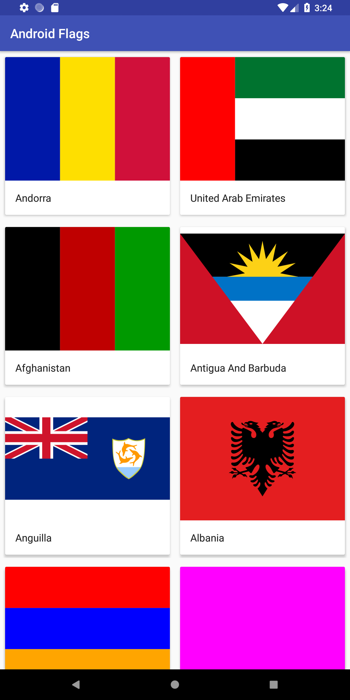
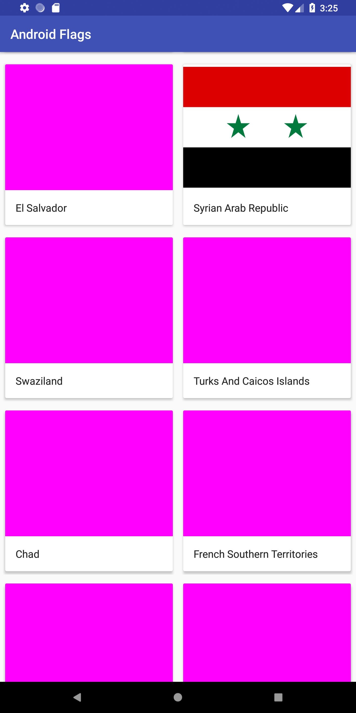

# Android Vector Flags

Small library for Android with vector drawables of the world country flags

### Current Existing flags:

Current flag country (code) list:
 * Andorra (ad)
 * United Arab Emirates (ae)
 * Afghanistan (af)
 * Antigua and Barbuda (ag)
 * Anguilla (ai)
 * Albania (al)
 * Armenia (am)
 * Argentina (ar)
 * Austria (at)
 * Australia (au)
 * Azerbaijan (az)
 * Bosnia and Herzegovina (ba)
 * Barbados (bb)
 * Belgium (bd)
 * Burkina Faso (bf)
 * Bulgaria (bg)
 * Brazil (br)
 * Canada (ca)
 * Switzerland (ch)
 * China (cn)
 * Czeck Republic (cz)
 * Germany (de)
 * Denmark (dk)
 * Spain (es)
 * France (fr)
 * Great Britain (gb)
 * Georgia (ge)
 * Greece (gr)
 * Hong Kong (hk)
 * Italy (it)
 * Japan (jp)
 * Lithuania (lt)
 * Mexico (mx)
 * Malaysia (my)
 * Neetherlands (nl)
 * Palestinian Territory, Occupied (ps)
 * Polland (pl)
 * Qatar (qa)
 * Rusia (ru)
 * Syria (sy)
 * United Kingdom (uk)
 * United States of America (us)
 * Viet Nam (vn)

### update and test
This project is updated to run in Android Studio 3.3.2 

The project tested in Pixel Emulator with API 27

### TODO
Too many flags still needed to be added.

| Existed                   | Missed                    |
|---------------------------|---------------------------|
| ||

